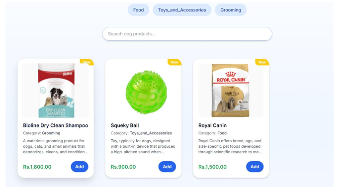
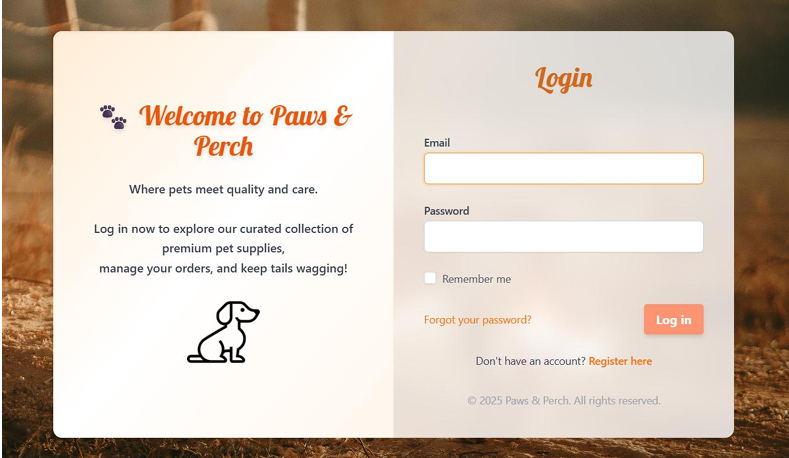
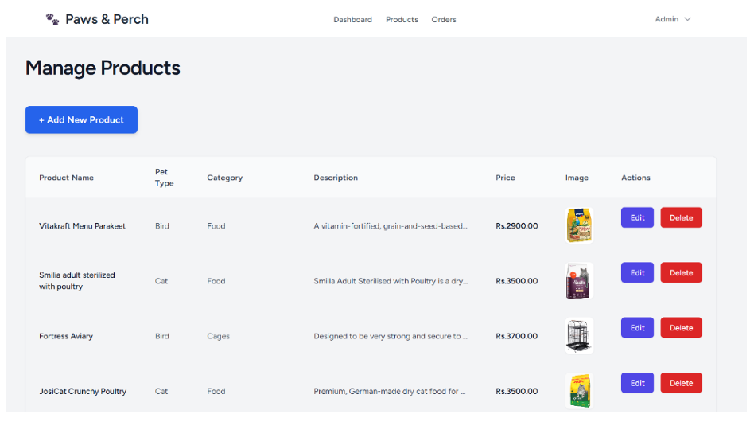
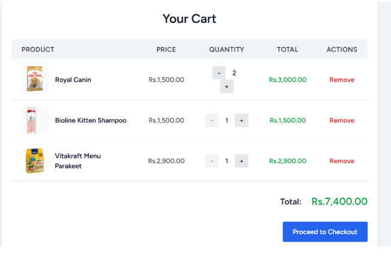
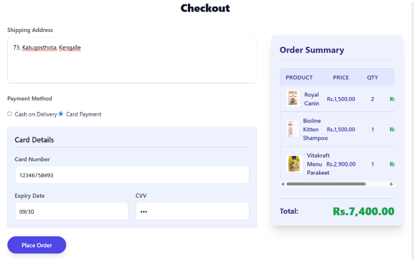
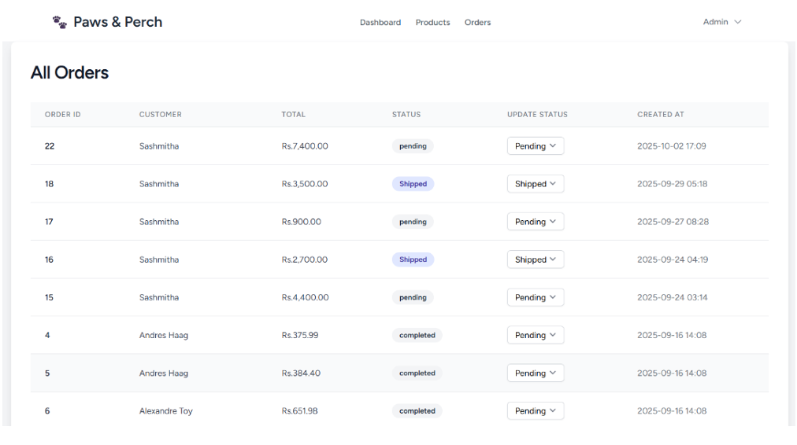

# Paws & Perch – Pet Supply E-Commerce Platform

## Overview

Paws & Perch is a full-stack pet supply e-commerce application developed using Laravel, PHP, and MySQL. It provides an online shopping platform for pet owners to browse and purchase pet products, while allowing administrators to manage product inventory and customer orders.

The application supports products for dogs, cats, and birds, with customer account management, secure authentication, shopping cart functionality, and order processing. The project was deployed using AWS EC2.

## Features

### Customer Features

* Customer registration, login, and logout.
* Email-based OTP verification during login.
* Password reset functionality.
* Browse pet products by category, including dogs, cats, and birds.
* Search for products and view product details.
* Add products to the shopping cart, update quantities, and remove items.
* Checkout with cash-on-delivery payment.
* Place orders and view order history.

### Admin Features

* Dedicated administrator login.
* Admin dashboard for managing the application.
* Add, view, update, and delete products.
* Manage product information and inventory.
* View customer orders and update their status.
* Cancel orders when required.

### Security Features

* CSRF protection for sensitive forms.
* OTP-based customer login verification.
* Role-based access control for customers and administrators.
* Password hashing instead of storing plain-text passwords.
* Client-side and server-side input validation.
* Form validation for missing fields, invalid credentials, and weak passwords.

## Technology Stack

* **Backend:** PHP, Laravel
* **Database:** MySQL
* **Frontend:** Blade templates and the HTML, CSS, and JavaScript used in the application
* **Cloud Deployment:** AWS EC2
* **Security:** OTP verification, CSRF protection, password hashing, and role-based access control
* **Version Control:** Git and GitHub

## Application Architecture

The application uses Laravel for server-side application logic and MySQL for relational data storage.

1. **Presentation layer:** Provides the customer shopping interface and administrative pages.
2. **Application layer:** Handles authentication, product management, cart operations, checkout, order processing, and access control through Laravel.
3. **Database layer:** MySQL stores application data, including customer accounts, products, and orders.
4. **Deployment layer:** AWS EC2 hosts the application environment.

Customer and administrator access is separated by role-based access control, ensuring that administrative functionality is restricted to authorized users.

## Application Screenshots


### Home Page and Product Categories



### Customer Login and OTP Verification

| Login Screen | Verify OTP | OTP Code |
|  |  |  |

### Product Management Dashboard



### Shopping Cart



### Checkout



### Admin Order Management



## Testing

Functional and security test cases were documented and tested for the application.

Testing covered:

* Customer registration and login.
* OTP verification, including invalid OTP attempts.
* Password validation and password reset.
* Handling missing fields and invalid credentials.
* Product browsing and searching.
* Shopping cart operations and checkout validation.
* Product creation, updates, and deletion by the administrator.
* Order management and status updates.
* CSRF protection, role-based access control, and input validation.

## Installation and Setup

### Prerequisites

* PHP and Composer
* Laravel-compatible PHP extensions
* MySQL
* A compatible web server or Laravel development environment

### Setup Instructions

1. Clone the repository:

   ```bash
   git clone <your-repository-url>
   cd <repository-directory>
   ```

2. Install the PHP dependencies:

   ```bash
   composer install
   ```

3. Create the environment configuration file:

   ```bash
   cp .env.example .env
   ```

   On Windows, copy `.env.example` to `.env` manually if necessary.

4. Configure the database connection and any required mail settings in `.env`.

5. Generate the Laravel application key:

   ```bash
   php artisan key:generate
   ```

6. Create the required MySQL database and run the project's migrations, if applicable:

   ```bash
   php artisan migrate
   ```

7. Start the Laravel development server:

   ```bash
   php artisan serve
   ```


## Author

**Sashmitha Jayaseelan**
